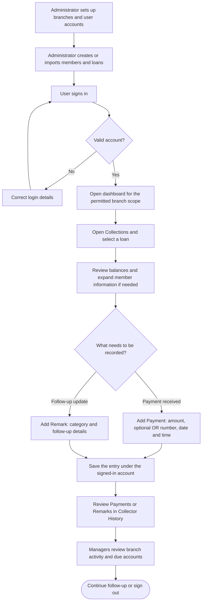
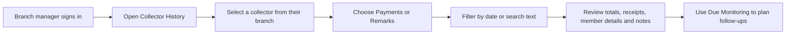

# Collection Monitoring — Client System Flow

This system helps the cooperative maintain member and loan records, record collections, document follow-ups, and review activity by collector and branch.

“Branch Manager” in this guide refers to the **Branch Admin** account in the application.

## 1. Overall process

Setup happens before daily use. Payments and remarks are independent entries: users can record either one, or both when appropriate. Manager review does not represent a payment approval step; saved payments appear immediately.

## 2. Who does what?

| Role | Main responsibilities | Collector-history visibility |
| --- | --- | --- |
| Super Administrator | Manage branches and accounts; maintain member and loan records; review activity across branches. | Collectors across all branches. |
| Branch Manager / Branch Admin | Create collector accounts for their branch; maintain branch member and loan records; review due accounts and collector activity. | Collectors currently assigned to their own branch, with activity restricted to that branch. |
| Collector | Open branch loan records; record payments and follow-up remarks; review their own entries. | Only their own recorded payments and remarks within their branch. |

The current system separates **record ownership** from **loan visibility**. Collectors can browse their branch's members and loans, but payment and remark lists show only entries they personally recorded. The dashboard displays branch-level totals. Individual loan-to-collector assignment is not currently implemented.

## 3. Daily collector workflow

1. **Sign in** using the collector account.
2. Open **Collections** and select a loan.
3. Review **Principal, Interest, Penalty, and Total Outstanding** at the top of the page.
4. Click the member information card to expand it when contact information or other loan details are needed. It starts collapsed.
5. To record money received, click **Add Payment**. Enter the amount, optional OR number, and payment date/time, then select **Save Payment**.
6. To document a follow-up, click **Add Remark**. Select a category, enter the note, and select **Save Remark**. Categories include promised to pay, partially paid, fully paid, and rescheduled payment.
7. After a successful save, the modal closes and the corresponding list refreshes. Each list has separate pagination, with five entries per page.
8. Open **Collector History**, select your account, and use the **Payments** or **Remarks** tab to review your entries. Search and date filters help find a specific record.

If required information is missing or invalid, correct it before saving. A failed save keeps the form available for correction or retry.

## 4. Branch manager review

Managers can also open a collector's history by clicking their row in **Accounts**. The history list displays 20 entries per page. Summary cards reflect the selected collector and search/date filters; switching between Payments and Remarks changes the activity list and its pagination.

## 5. Main navigation

| Tab | Purpose |
| --- | --- |
| Dashboard | Review portfolio balances, overdue amounts, and collections for today within the user's branch scope. |
| Members | Find member information. Administrators can create or import member records. |
| Collections | Find loan records and open loan details to record payments or remarks. |
| Collector History | Select a collector and review payments, receipts, and follow-up notes. |
| Accounts | Administrators manage permitted user accounts and open collector history. |
| Branches | Super administrators manage branch records. |
| Due Monitoring | Administrators review upcoming and overdue accounts for follow-up. |

## 6. Recording rules to explain during the client demonstration

- **Payments are collection records.** Saving a payment does not automatically deduct it from the displayed loan balance or close the loan. Loan balances and status are maintained separately.
- **Remarks document an update.** Selecting “Fully Paid” or another remark category does not automatically change the loan's status.
- **Entries identify the recorder.** The system associates payments and remarks with the signed-in account.
- **History reflects current records.** Deleted payments or remarks disappear from history. Deleting an account removes its attribution from retained records.

## 7. Suggested client demonstration

Show the workflow in this order: sign in, open a loan, expand member information, add a sample payment, add a follow-up remark, review both history tabs, then sign in as a branch manager to review a collector and open Due Monitoring. Use demonstration records for sample entries.
